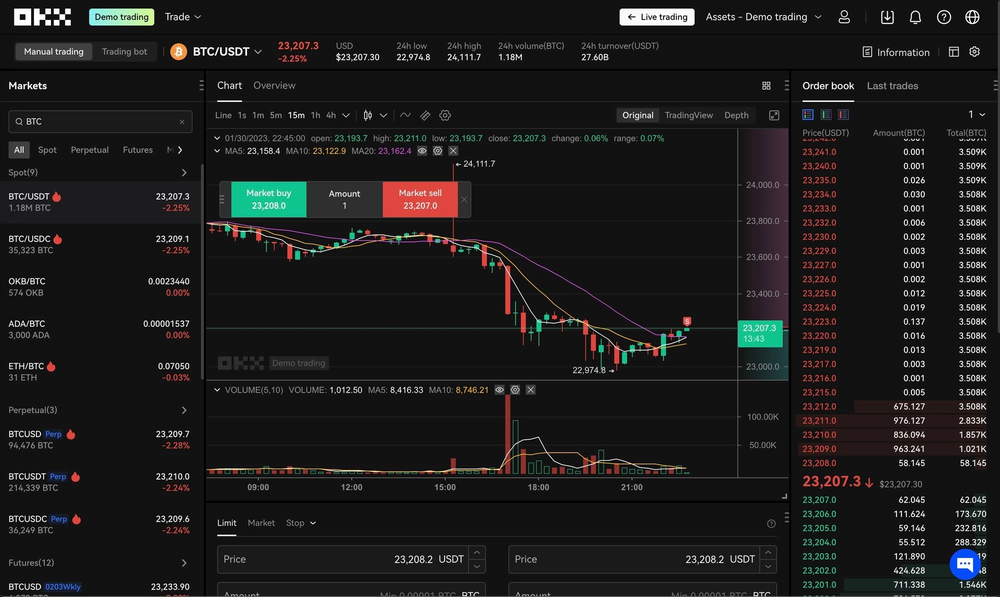

# OKX Review: Features, Safety, and Trading Costs

Wondering if OKX is the right crypto exchange for your trading needs? This comprehensive review explores OKX's low-fee structure, Web3 capabilities, and safety measures—covering everything from copy trading features to proof of reserves. Whether you're comparing alternatives or ready to start trading over 350 digital assets, discover why OKX remains a reliable choice for spot trading, staking, and NFT transactions across global markets.

---

**OKX** stands as one of the world's most recognized crypto exchanges, famous for its **low fee structure** and comprehensive **Web3** ecosystem.

While it's not available to US-based users, it remains a solid choice for anyone looking to buy, stake, and trade an extensive portfolio of currencies and digital assets like **NFTs**.

This review takes a close look at OKX's features, fees, strengths, and weaknesses, giving you a detailed picture of what this exchange offers.

## What is OKX?

**OKX** is a crypto exchange where you can **buy**, **sell**, and trade various cryptocurrencies and digital assets.

You can **fund your OKX account** using a credit card, bank account, or mobile wallet. The platform also lets you **earn attractive rewards** through **staking** and **savings** programs.

OKX supports **hundreds of cryptocurrencies** and offers a wide range of services. But as mentioned, it's off-limits for United States residents.

If you want to handle all your crypto activities in one place, OKX might be worth considering.

### A bit of history

**OKX** is headquartered in Valletta, Malta, and ranks among the **largest platforms** of its kind worldwide.

With users spanning more than **100 countries**, the exchange claims over **20 million clients**. However, **regulatory restrictions** prevent it from serving US-based customers.

OKX provides a **comprehensive** suite of services to eligible users, including trading over 340 spot currencies, margin borrowing, staking, savings, crypto-backed loans, and advanced offerings like mining pools and its proprietary blockchain, **OKXChain**.

Founded by **Star Xu** (real name: Mingxing Xu) in 2017, OKX evolved from the successful **foundation** of its predecessor, **OKCoin**, which Xu launched in China back in 2013.

Before establishing Binance, **CZ** and **He Yi** also spent time at OKCoin, cutting their teeth in the crypto world.

Under Xu's leadership, OKCoin evolved into the OK Group, a company focused on providing **blockchain infrastructure**.

However, OKX operates as a separate entity from OK Group. Despite his key role in founding OK Group, Xu has no affiliation with OKX itself, serving only as **CEO** of **OK Group**.

For those seeking a versatile platform for their cryptocurrency needs, **OKX** works well as either a **complementary exchange** or a primary hub for **all things crypto**.

## Getting started with an OKX account

Setting up an **OKX** **account** is straightforward and takes just a few minutes.

- Head to the **OKX website** and click the "**Sign Up**" button in the top right corner.

👉 [Start trading on OKX with lower fees—create your account here](https://www.okx.com/join/47044926)

- Fill out the registration form with your **personal information**: name, email, and a secure password mixing letters, numbers, and capitalization.
- You'll receive an email from OKX. Click the **activation** link to activate your account.
- For better security, **enable two-factor authentication using Google Authenticator or Authy**.
- To **deposit funds**, you'll need to complete KYC verification by providing personal information and documentation.
- Once verified, you can deposit funds and unlock more platform features.

Following these steps gets you a **fully operational OKX** **account** ready for **crypto** trading. Just remember to keep your account details and login credentials secure.

## How to fund your OKX account

To start operating on **OKX**, you first need to **deposit** funds. There are **two main ways** to do this:

1. Purchase cryptocurrencies using fiat currencies through the Buy Crypto channel.
2. Transfer existing cryptocurrency assets from another wallet to your OKX Funding Account.

### Buying and selling crypto

At **OKX**, buying and selling **crypto** is made convenient through multiple methods.

- First, you can **purchase cryptocurrency using debit or credit cards**, with support for **over 94 currencies** and various cards including VISA, Mastercard, and Apple Pay. Curve is also supported.
- Second, OKX offers **P2P trading**, letting you create your own marketplace and transact with others using your preferred local currency and payment methods like Revolut or Wise.
- Lastly, OKX partners with third-party payment providers like **Mercuryo**, **Simplex**, **Banxa**, and **Moonpay** to **streamline crypto transactions**.

### Trading options

The OKX **active trading platform** caters to experienced traders, offering **market**, **limit**, and **stop** orders, advanced **conditional trades**, real-time updates on **supported currencies**, and customizable **charting options**.

The platform also allows **personalization**, giving users the option to create custom layouts and integrate a **built-in trading bot** to implement **trade strategies** with **precision**.

In the trading section, you'll find:

- **Conversion**: fast conversion with zero fees and no slippage
- **Basic Trading**: includes Spot or Simple Options
- **Derivatives and Margins Trading**: comprehensive contracts and margin products, including Futures, Margins, Options, and Perpetual Swaps
- **Trading Bots**: multiple automated strategies through a Marketplace, plus the ability to create custom bots
- **The Liquid Marketplace**: instant trading of spot OTC, futures spreads, and options strategies at your preferred price

## Is OKX safe to use?

Having started in **Hong Kong**, **OKX** has since expanded to **Malta**, where it **operates under strict local regulations** to ensure **maximum security for users**.

The platform's security measures mirror those of popular exchanges like Coinbase and KuCoin, including **bank-level SSL encryption**, **KYC (know-your-customer)** verification, email verification codes, **2-factor authentication**, withdrawal passwords, and mobile verification codes, all working together to deliver a **smooth and secure experience**.

**OKX** implements several security features for **safe storage** and handling of **cryptocurrencies**. One key feature is **offline storage**, where crypto assets are kept in secure locations disconnected from the internet. This protects assets from potential online hacking or security breaches.

Additionally, OKX maintains **online storage** on servers protected by multiple security layers.

The **OKX Risk Shield** provides another layer of protection with **real-time monitoring** against potential security threats. Together, these features create a **comprehensive and secure environment** for **storing and handling cryptocurrencies**.

Despite past controversies and mixed reviews, **OKX** has persevered and strengthened its infrastructure security, protecting its **reputation** and ensuring user **safety**.

### OKX Proof of reserves

OKX takes pride in ensuring the safety and security of customer assets.

The company maintains a **1:1 reserve** of all customer assets on its platform and provides full transparency regarding reserves and customer funds.

The **safety and security** of funds is the company's top priority. OKX's reputation for best-in-class security is reinforced through **Proof of Reserves (PoR)**.

The **company's on-chain wallet holdings** are publicly available, allowing customers to verify that their funds are backed 1:1 by real assets.

OKX regularly publishes Proof of Reserve audits, making it easy for customers to confirm their assets are **securely held** in the company's reserves.

### Regulatory compliance

As mentioned, OKEx is registered in both Hong Kong and **Malta**, offering **VFAA** compliant trading services.

As a regulated authority under **Malta Financial Services**, the **Virtual Financial Asset Act** or **VFAA** ensures OKX's trustworthiness. With a proven track record of security and favorable user experiences, OKX is widely regarded as one of the **safest crypto trading platforms** globally.

## OKX fee structure

**OKX** offers a **comprehensive fee structure** covering various aspects of trading, deposits, withdrawals, staking, and more.

### Trading fees

**Fees** for trading vary between regular and **VIP** users.

Regular users are grouped based on their total OKB holdings, while VIP users are classified by **30-day trading volumes** and daily asset balances.

These tiers are **reviewed daily**. If you meet requirements for different fee tiers—including **spot trading volume**, total trading volume of futures and perpetual contracts (USDT-margined, USDC-margined, and crypto-margined), options trading volume, and total assets—you'll receive the **highest fee tier** discount.

For example, if your 30-day spot trading volume is 20,000,000 USD (VIP 2), 30-day total trading volume of futures and perpetual contracts is 200,000,000 USD (VIP 3), 30-day options trading volume is 5,000,000 USD (VIP 1), and your total assets today are 5,000,000 USD (VIP 4), you'll receive discounts in all markets as a VIP 4 user.

OKX has an attractive fee structure, with market makers paying from a 0.08% fee and market takers from a 0.10% fee, placing the exchange among the most cost-effective options.

### Deposit and withdrawal fees

OKX's withdrawal fees are also low, with a 0.0005 BTC fee for Bitcoin withdrawals, making it cost-efficient.

As a no-fiat exchange, OKX doesn't charge deposit fees for funding accounts with cryptocurrencies.

Overall, OKX is worth considering, especially for low market cap altcoin investments.

## Available cryptocurrencies

OKX supports a comprehensive range of cryptocurrencies, offering access to over **350 digital assets** and more than 500 trading pairs.

The platform has a diverse portfolio of tokens, including well-established **cryptos** like:

- Bitcoin (BTC)
- Ethereum (ETH)
- OKB (OKX Utility Token)
- Aave (AAVE)
- Solana (SOL)
- Cardano (ADA)
- Polygon (MATIC)
- Ripple (XRP)
- Dogecoin (DOGE)
- Shiba Inu (SHIB)
- Polkadot (DOT)

## Key OKX features

**OKX** offers several features that provide unique insights into the cryptocurrency realm.

This section highlights key OKX features beyond basic trading and purchasing, including **copy trading**, earning opportunities, lending, the **Web3 wallet**, and an uncommon feature—**demo trading**.

### OKX Copy Trading

This tool lets users share successful trading strategies and **earn profits** or learn from professional traders worldwide by **copying their trades**.

By becoming a **lead trader**, users can earn an additional **12% profit share** from followers. **Copy Trading** offers a unique opportunity to learn from top traders and enhance your trading experience.

### OKX Earn

OKX offers numerous ways to obtain crypto, including complimentary Bitcoin offers, services like OKX Pool, and decentralized finance offerings within MetaX.

There are also off-chain options for **generating passive income**. OKX Earn serves as a centralized hub for all earning opportunities on the platform.

Currently, OKX Earn offers eight products for **earning passive income** with crypto assets:

- Staking
- Savings
- Dual Investment
- DeFi
- DOT and KSM slot auctions
- ETH 2.0 staking
- Jumpstart
- P2P lending

### Web3 Wallet

The **OKX Wallet** is an advanced and secure **digital asset management** solution, offering a noncustodial platform for storing multichain assets.

It's an all-around platform combining the functions of a crypto wallet, decentralized exchange, Non-Fungible Token marketplace, and yield generation.

Available as either a browser extension or mobile/web application, this wallet gives you complete control over your Web3 Wallet and stored crypto assets.

As custodian of your funds, you're the sole owner with authority to transfer assets on any supported network. No other participant, including OKX, has authority over your wallet.

### OKX Demo Trading

OKX offers an excellent opportunity to sharpen trading skills through a fully-functional demo trading platform.

With access to the entire portfolio of tokens offered on the real exchange, you get unlimited possibilities to practice and familiarize yourself with cryptocurrency market functions, both manual and bot trading, on spot or futures contracts.

This valuable tool serves as excellent training for when you're ready to invest real money in crypto. To use the demo trading account, you just need to open an account. **No KYC needed**.

👉 [Practice risk-free with OKX demo trading—sign up now](https://www.okx.com/join/47044926)

## OKX trading platforms

OKX presents **three distinct modes** of access: a convert super-simple platform, a **straightforward** web application, or mobile applications for both Android and **iOS devices**.

Let's examine **each option** in detail to understand the functionality and **features OKX offers**.

### OKX Convert Trading Platform

The Convert platform by OKX epitomizes simplicity in trading.

With the ability to seamlessly exchange top cryptocurrencies and stablecoins with zero fees and minimal price deviation, the Convert platform streamlines the trading experience for users of all levels.

By simply selecting your desired conversion pair, OKX handles the rest, ensuring trades are executed promptly and efficiently.

Although this option may be more costly than others (trades execute at market price rather than a set limit), it remains an excellent choice for **novice** traders seeking a straightforward and user-friendly solution.

### OKX Advanced Trading Platform

The **OKX** active trading platform caters to seasoned traders with sophisticated features, including support for market, limit, and stop orders, advanced conditional trades, and flexible market charts.

The platform also offers a comprehensive **open order book** for supported coins on the OKX exchange.

The convenience of choosing from **multiple available layouts** or building custom ones enhances the overall trading experience for advanced users.

Additionally, the platform includes a built-in **trading bot**, allowing users to execute trades with predefined **rules**, ideal for margin trading or executing other advanced strategies.

### OKX Mobile Apps

The OKX mobile applications for **iOS** and **Android** offer a **simplified trading experience** while providing **flexibility** to trade cryptocurrencies on-the-go.

The **apps** grant access to diverse features, including margin and derivative trading, a Non-Fungible Token marketplace, a decentralized finance wallet, and much more, all from your mobile device.

The seamless integration of these essential tools into one centralized platform enhances the overall trading experience for users seeking a more convenient and accessible solution.

## User feedback and reviews

OKX has received mixed feedback on consumer review platforms. While users praise its **seamless** online interface, prompt transactions, and minimal fees, critics mention lackluster customer support, **missing funds**, and sluggish withdrawal speeds.

On Trustpilot, OKX holds a moderately impressive average rating of 3.3 stars out of five, based on nearly 450 evaluations—a score well above average for cryptocurrency exchanges.

## OKX alternatives

Suitable alternatives for OKX include exchanges with extensive altcoin selections, NFT capabilities, and power user functions.

**KuCoin**: Positioned as one of the major Asian exchanges, KuCoin offers buying and selling of Bitcoin and numerous other cryptocurrencies. If you prefer altcoins and reside outside the USA or Canada, KuCoin could be suitable, provided you're comfortable with KYC requirements.

**Binance**: Despite challenges involving its founder Changpeng Zhao and the discontinuation of its fiat partner Paysafe, Binance remains the largest exchange globally in terms of liquidity. Considering its extensive range of features and trading instruments, it remains noteworthy.

## Pros and cons

| Pros | Cons |
|------|------|
| Low trading fees, with most trades incurring 0.08% or less | Currently inaccessible to users in the United States |
| Generous high-interest staking options | Limited liquidity for some cryptocurrencies |
| Effortless acquisition of cryptocurrency via credit/debit card, bank account, or digital wallet | Mixed feedback from previous users |

---

## Final thoughts

**OKX** is one of the biggest cryptocurrency exchanges out there, **Malta-regulated** and widely trusted by a substantial number of users.

It offers a **straightforward** and convenient platform for individuals of all cryptocurrency proficiency levels, allowing for the purchase, retention, and exchange of a diverse array of popular cryptocurrencies, all at **competitive transaction fees**.

However, some previous inconsistencies, ambiguous information, and customer complaints warrant a cautious approach. To ensure **maximum security** for your account and assets, utilize **OKX**'s advanced security features.

With familiarity of online financial products and adherence to security best practices, you can expect a positive experience with OKX—making it particularly suitable for traders seeking low fees, extensive altcoin selection, and Web3 integration ([join here](https://www.okx.com/join/47044926)).

## Frequently asked questions (FAQ)

### Is OKX safe?

OKX employs security measures such as cold storage for a majority of customer assets and offers additional protection through options like a withdrawal password, two-factor authentication, and anti-phishing codes.

### What is the OKX giveaway?

It's a promotion to mark the launch of the OKX brand campaign, giving away $100,000 in BTC. By entering your email, you can find out if you're a winner.
